# Balatro High Card Mod
A Balatro mod that introduces X-Play Mechanics to the game along with 1 deck and 52+ X-Playing Cards. 

[Official Website](https://www.balatrohighcardmod.com/) is now available! 

[Mod Trailer](https://www.youtube.com/watch?v=ae5O06sSRlY) is also available!

The mod takes inspiration from the anime series "High Card", with joker art and mechanics dedicated to connecting the two popular works on poker cards. 

  

# Installation

1. Please install [Steamodded](https://github.com/Steamopollys/Steamodded) via its instructions (Currently support 0.9.8+, 1.0 WIP). This is used by most of the Balatro mods.
   
Quick Install for step 2: download the zip file and unzip them in Steamodded's Mods folder (the version number indicates steamodded version). You should get a folders called `HighCardMod`;

2. Install HighCardMod simply by download `HighCardMod` folder put them in Steamodded's Mods folder.

3. Enjoy your journey as a **PLAYER**!

**Note: The first full release of this mod happened on May 18, 2024. If you have played a version prior to this date, I recommend a refresh install!** 

# X-Playing Cards and X-Playing Deck

Once you install the mod, you will see a new deck called *X-Playing Deck*, this deck will have **52 X-Playing Cards** and a Legendary Joker at the beginning of the run:

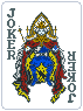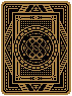

**X-Playing Card** will transform into a **special joker** once you play and score it as **High Card** as your **first hand of the round**.

At the end of the round, it will **transform** back to the **X-Playing Card** so you can decide to PLAY something else next round! (with a few exceptions!)

**X-Playing Joker** on the other hand will convert regular playing cards into **X-Playing Cards** when needed!

# Currently Supported X-Playing Cards (52 / 52)

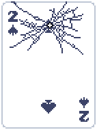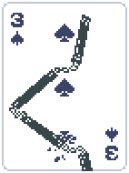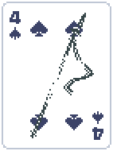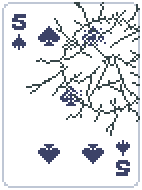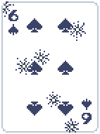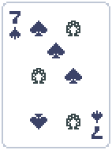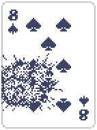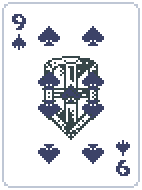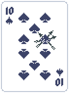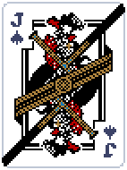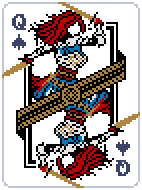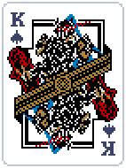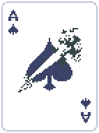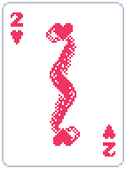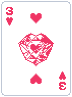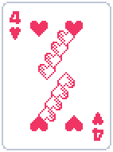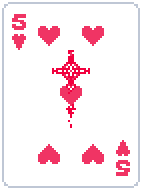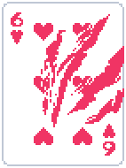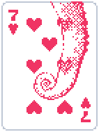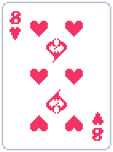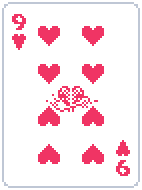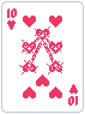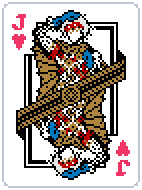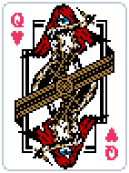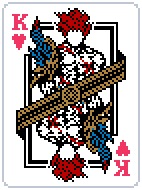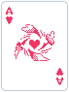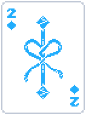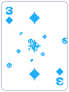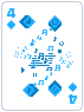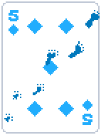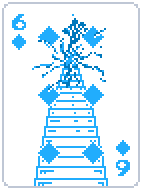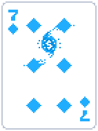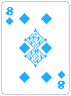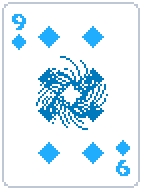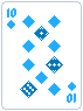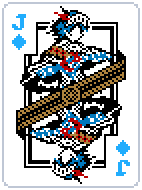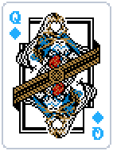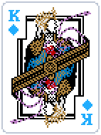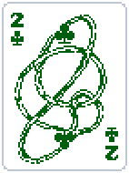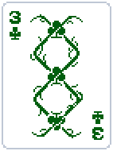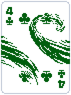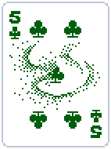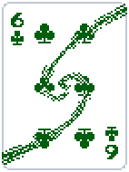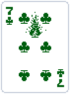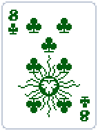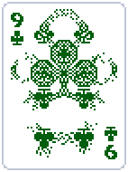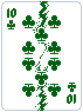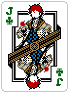

You can discover their amazing abilities in collection tab once you install the mod or on the mod website [here](https://www.balatrohighcardmod.com/)! More X-Playing Cards and X-hands are WIP! 

Feel free to reach out in the modding chat of [Balatro official discord](https://discord.com/invite/balatro)! 

The original author's IGN is **Kenny Stone**.
